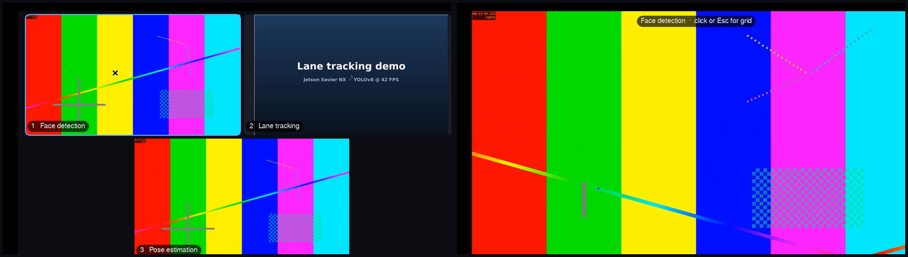
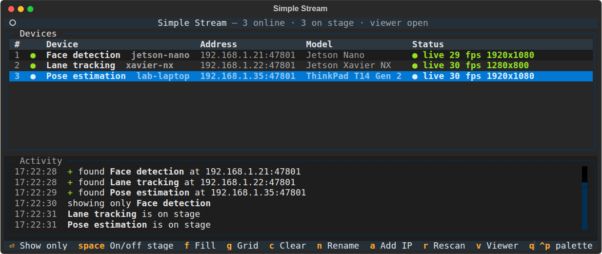

# Simple Stream

Show the screens of your edge devices (Jetson Nano, Jetson Xavier, Linux laptops…) on the laptop you
present from, then share that one window in Google Meet / Zoom / Teams.

- **Client** (`client.sh`, each edge device): a tiny Python program with no dependencies besides ffmpeg. While
  nobody is watching it only sends a small "I'm here" packet every 2 s. It captures the screen only while
  the presenter is actually showing it. On Jetsons it uses the hardware H.264 encoder.
- **Server** (`server.sh`, presenting laptop): a terminal app that **finds devices automatically** (like LocalSend)
  plus a viewer window with a grid of the selected devices. **Click a tile to fill the window with it**,
  click again to go back to the grid.




## Install

Two scripts, one per role. Each installs a command-line app.

**On every edge device** (Jetson / Linux with an X11 desktop):

```bash
curl -fsSL https://raw.githubusercontent.com/haneeshbyreddy/simple_stream/main/client.sh | bash -s -- --name "Face detection"
```

**On the presenting laptop** (Ubuntu 22.04+ or any Linux with Python 3.10+):

```bash
curl -fsSL https://raw.githubusercontent.com/haneeshbyreddy/simple_stream/main/server.sh | bash
```

All devices must be on the same network as the laptop (same router or phone hotspot).
Run the same command again to update.

## Use

### Laptop: `simplestream`

```
simplestream                  open the device picker + the viewer window
simplestream list             list the devices on the network
simplestream show lane jetson open just the viewer with these devices (name, hostname or IP)
simplestream uninstall
```

1. Run `simplestream`. Devices show up by themselves, and the **Simple Stream** viewer window opens.
2. In Meet: *Present → A window → Simple Stream*. The window stays open the whole time, so the
   share never breaks while you switch devices.
3. Pick what to show from the terminal:

| Key | In the picker |
|---|---|
| `1`…`9` | show only device N (fastest way to switch between projects) |
| `Enter` | show only the highlighted device |
| `Space` / click | add or remove the device from the grid |
| `f` / `g` | fill the window with the highlighted device / back to the grid |
| `c` | clear (the viewer shows a neutral screen) |
| `n` | rename a device (remembered on this laptop) |
| `a` / `r` | add a device by IP / rescan the network (only needed if a device isn't found) |
| `v` | reopen the viewer window · `q` quit |

| Viewer window | |
|---|---|
| click a tile | fill the window with it; click again (or `Esc`, right click) for the grid |
| `1`…`9`, `0` | fill with tile N, back to grid |
| `F11` or `f` | fullscreen |
| `l` | hide/show the name labels |

### Device: `simplestream-client`

It runs as a background service that starts on boot, so normally you never touch it.

```
simplestream-client                     status: name, address, running or not
simplestream-client name "Face detection"
simplestream-client start | stop | restart | logs
simplestream-client uninstall
```

## How it works

```
 edge device                                   presenting laptop
┌─────────────────────────┐   UDP beacon     ┌───────────────────────────┐
│ simplestream-client     │ ───────────────▶ │ simplestream (picker)     │
│  every 2 s: 224.0.0.177 │   port 47800     │   device list, stage      │
│  + broadcast, all NICs  │                  │        │ JSON over stdin  │
│                         │  HTTP GET        │        ▼                  │
│  :47801/stream ─────────│ ◀─────────────── │ viewer (pygame + PyAV)    │
│  ffmpeg x11grab + x264  │  raw H.264 ────▶ │   grid, click to fill     │──▶ share in Meet
│  or Jetson HW encoder   │                  └───────────────────────────┘
└─────────────────────────┘
```

- **Discovery**: clients announce themselves on every network interface via multicast *and* broadcast.
  If the network blocks both, the server also scans its local subnets (`GET /info`), and you can add an IP by hand.
- **Streaming**: when the viewer connects, the client starts the encoder: GStreamer
  `ximagesrc → nvvidconv → nvv4l2h264enc` on Jetson (falls back to ffmpeg automatically), `ffmpeg x11grab →
  libx264 ultrafast/zerolatency` elsewhere. When the viewer disconnects, the encoder is killed. Latency is
  roughly 100–200 ms on a LAN.
- Debug a device from anywhere: `curl http://DEVICE:47801/info` or `ffplay -f h264 http://DEVICE:47801/stream`.

## Client settings

`/etc/simplestream.conf` on the device (then `simplestream-client restart`):

```bash
SS_NAME="Face detection"
SS_FPS=30              # frames per second
SS_MAX_SIZE=1920x1080  # bigger screens are scaled down to fit
SS_KBPS=8000           # max bitrate
SS_ENCODER=auto        # auto | jetson | x264
```

(Put comments on their own line in the real file; systemd doesn't allow them after a value.)

## Troubleshooting

- **Device doesn't appear**: check it's on the same network (`hostname -I` on both). Guest/campus Wi-Fi
  often blocks devices from talking to each other; use your own router or a phone hotspot. Press `r` to
  rescan or `a` to type its IP. Check the device with `simplestream-client`.
- **"no desktop session"**: somebody has to be logged in on the device's desktop (enable auto-login on Jetsons).
- **Black picture / Wayland warning**: screen capture needs an X11 session. On the login screen pick
  *Ubuntu on Xorg* (gear icon). Jetsons use X11 already.
- **Logs**: `simplestream-client logs` on the device, `~/.cache/simplestream/viewer.log` on the laptop.

**Security**: there is no password. Anyone on the same network can view a device's screen while the client
is running. Use a private network, and stop it after the event with `simplestream-client stop` (or `uninstall`).

## Uninstall

`simplestream uninstall` on the laptop, `simplestream-client uninstall` on a device.
